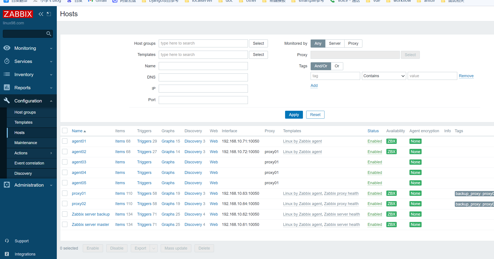
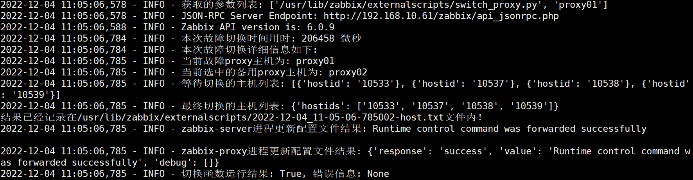

# switch_zabbix_proxy
用于切换zabbix-proxy的脚本


脚本的实现思路：

1. 通过传参获取故障proxy主机名称
2. 根据故障proxy主机名称获取对应的备选proxy列表
3. 获取备选proxy的nvps值，选取最小的来新的proxy
4. 通过主机接口，筛选出关联在故障proxy上的主机
5. 通过主机批量更新接口，更新相关主机的proxy到新的proxy上
6. 通过命令更新zabbix-server的配置文件
7. 通过脚本使新的proxy主动拉取zabbix-server上的配置文件

参考地址：

- https://blog.zabbix.com/how-to-setup-redundant-zabbix-proxies-without-complex-cluster-configurations/12092/

- https://www.zabbix.com/documentation/6.0/zh/manual/config/items/itemtypes/internal

- https://support.zabbix.com/browse/ZBXNEXT-5911

脚本安装路径：
```bash
/usr/lib/zabbix/externalscripts
# 权限信息
drwxr-xr-x 2 zabbix zabbix 4096 Dec  4 11:05 /usr/lib/zabbix/externalscripts/
-rw-rw-r-- 1 zabbix zabbix   49 Dec  4 11:05 2022-12-04_11-05-06-785002-host.txt
-rw-rw-r-- 1 zabbix zabbix 2664 Dec  4 11:05 switch_proxy.log
-rwxr-xr-x 1 zabbix zabbix 4977 Dec  4 10:11 switch_proxy.py*
```

效果图：





